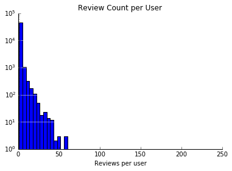
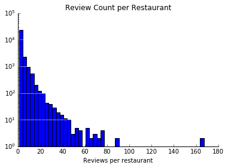
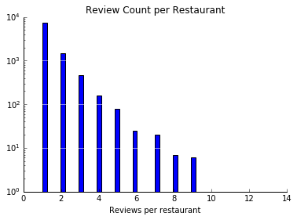
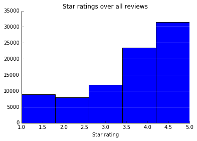
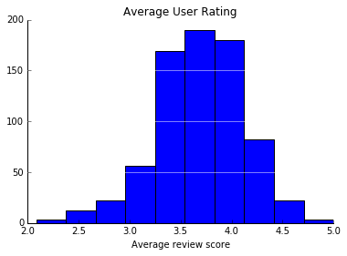

```python
# get reviews of restaurants within desired categories
def get_desired_restaurants(df, category_list):
    desired_rows = []

    for row in df.iterrows():
        for cat in category_list:
            # get row if it is in the correct category
            if cat in row[1]['categories']:
                desired_rows.append(row[1])

    df_desired = pd.DataFrame(desired_rows)

    # drop duplicates from multiple categories
    df_desired = df_desired[df_desired['review_id'].duplicated() == False]
    return(df_desired)           
```


```python
# to get all reviews within a certain time period - input string in YYYY format (ex: '2015')
def get_data_yearly(df, year):
    return df[df['date'].dt.strftime('%Y') == year]
```


```python
def remove_border(axes=None, top=False, right=False, left=True, bottom=True):
    """
    Minimize chartjunk by stripping out unnecesasry plot borders and axis ticks
    
    The top/right/left/bottom keywords toggle whether the corresponding plot border is drawn
    """
    ax = axes or plt.gca()
    ax.spines['top'].set_visible(top)
    ax.spines['right'].set_visible(right)
    ax.spines['left'].set_visible(left)
    ax.spines['bottom'].set_visible(bottom)
    
    #turn off all ticks
    ax.yaxis.set_ticks_position('none')
    ax.xaxis.set_ticks_position('none')
    
    #now re-enable visibles
    if top:
        ax.xaxis.tick_top()
    if bottom:
        ax.xaxis.tick_bottom()
    if left:
        ax.yaxis.tick_left()
    if right:
        ax.yaxis.tick_right()
        
pd.set_option('display.width', 500)
pd.set_option('display.max_columns', 100)
```


```python
df_biz = pd.read_json('/Users/alliwiggins/Documents/cs109a/dataset/business.json', lines = True)
df_check = pd.read_json('/Users/alliwiggins/Documents/cs109a/dataset/checkin.json', lines = True)

df_review_samp = pd.read_json('/Users/alliwiggins/Documents/cs109a/dataset/sample_review.json', lines = True)
df_usr_samp = pd.read_json('/Users/alliwiggins/Documents/cs109a/dataset/sample_user.json', lines = True)
```


```python
print("The total number of users read in is: ", df_usr_samp.shape[0])
print("The total number of reviews read in is: ", df_review_samp.shape[0])
```


    The total number of users read in is:  236535
    The total number of reviews read in is:  616040


```python
# get users that are represented in the review sample
df_usr_subset = df_usr_samp[df_usr_samp['user_id'].isin(df_review_samp['user_id'])]

# pare reviews down to those which have user data
df_rvw_subset = df_review_samp[df_review_samp['user_id'].isin(df_usr_subset['user_id'])]

# now we have two dataframes, each with same users, one has user data and the other has review data

# get business and check data corresponding to what reviews we have in the sample
df_biz_subset = df_biz[df_biz['business_id'].isin(df_rvw_subset['business_id'])]
df_check_subset = df_check[df_check['business_id'].isin(df_biz_subset['business_id'])]
```


```python
# 64301 unique businesses out of 1880087 total reviews (average 3 reviews for every restaurant)
print("The total number of unique recorded businesses in this sample is: ", len(df_rvw_subset['business_id'].unique()))
print("The total number of unique recorded users in this sample is: ", len(df_usr_subset['user_id'].unique()))
print("The total number of recorded reviews in this sample is: ", df_rvw_subset.shape[0])
```


    The total number of unique recorded businesses in this sample is:  50696
    The total number of unique recorded users in this sample is:  67101
    The total number of recorded reviews in this sample is:  123080


```python
# this dataframe contains every review, paired with the user who gave the review and the business that was reviewed
df_rvw_usr = df_usr_subset.merge(df_rvw_subset, on = 'user_id', how = 'left')

# this dataframe contains every review, user giving the review, and characteristics of business being reviewed
# each row represents a review
df_rvw_usr_biz = df_rvw_usr.merge(df_biz_subset, on = 'business_id', how = 'left')

# add in total checkin data for each restaurant (measure of popularity)
dict_checkins = {}

for index, row in df_check_subset.iterrows():
    for key in row['time'].keys(): 
        dict_checkins[row['business_id']] = np.sum(list(row['time'][key].values()))

checkin_series = pd.Series(dict_checkins, name = 'total_checkins')
df_check_merger = pd.DataFrame(checkin_series).reset_index()
df_check_merger.columns = ['business_id', 'total_checkins']

# this df contains all user, review, biz, and checkin data
df_all = df_rvw_usr_biz.merge(df_check_merger, on = 'business_id', how = 'left')

# there is not checkin data for some businesses - choosing to fill those with zeroes
df_all.fillna(0, inplace = True)

# confirmation that every original review in the subset is contained in this dataframe
print(df_all.shape[0] == df_rvw_subset.shape[0])
```


    True


```python
# dropping predictors

# drop latitude, longitude, neighborhood - too specific for predictors (stick with state,city as location identifiers)
# we're tracking names by user ids and restaurant ids, so we can drop names
# drop neighborhood since most entries don't have values

df_all.drop(['name_x', 'name_y', 'latitude', 'longitude', 'neighborhood'], axis = 1, inplace = True)

# rename columns to remove user, review, business ambiguity (some colnames were the same)
df_all.columns = ['average_stars_usr', 'compliment_cool', 'compliment_cute',
       'compliment_funny', 'compliment_hot', 'compliment_list',
       'compliment_more', 'compliment_note', 'compliment_photos',
       'compliment_plain', 'compliment_profile', 'compliment_writer', 'cool_usr',
       'elite', 'fans', 'friends', 'funny_usr', 'review_count_usr', 'useful_usr',
       'user_id', 'yelping_since', 'business_id', 'cool_rvw', 'date', 'funny_rvw',
       'review_id', 'stars_rvw', 'text', 'useful_rvw', 'address', 'attributes',
       'categories', 'city', 'hours', 'is_open', 'postal_code',
       'review_count_biz', 'stars_biz', 'state', 'total_checkins']
```


```python
df_all.head()
```


<div>
<style>
    .dataframe thead tr:only-child th {
        text-align: right;
    }

    .dataframe thead th {
        text-align: left;
    }

    .dataframe tbody tr th {
        vertical-align: top;
    }
</style>
<table border="1" class="dataframe">
  <thead>
    <tr style="text-align: right;">
      <th></th>
      <th>average_stars_usr</th>
      <th>compliment_cool</th>
      <th>compliment_cute</th>
      <th>compliment_funny</th>
      <th>compliment_hot</th>
      <th>compliment_list</th>
      <th>compliment_more</th>
      <th>compliment_note</th>
      <th>compliment_photos</th>
      <th>compliment_plain</th>
      <th>compliment_profile</th>
      <th>compliment_writer</th>
      <th>cool_usr</th>
      <th>elite</th>
      <th>fans</th>
      <th>friends</th>
      <th>funny_usr</th>
      <th>review_count_usr</th>
      <th>useful_usr</th>
      <th>user_id</th>
      <th>yelping_since</th>
      <th>business_id</th>
      <th>cool_rvw</th>
      <th>date</th>
      <th>funny_rvw</th>
      <th>review_id</th>
      <th>stars_rvw</th>
      <th>text</th>
      <th>useful_rvw</th>
      <th>address</th>
      <th>attributes</th>
      <th>categories</th>
      <th>city</th>
      <th>hours</th>
      <th>is_open</th>
      <th>postal_code</th>
      <th>review_count_biz</th>
      <th>stars_biz</th>
      <th>state</th>
      <th>total_checkins</th>
    </tr>
  </thead>
  <tbody>
    <tr>
      <th>0</th>
      <td>3.91</td>
      <td>7</td>
      <td>0</td>
      <td>7</td>
      <td>1</td>
      <td>0</td>
      <td>1</td>
      <td>8</td>
      <td>2</td>
      <td>17</td>
      <td>0</td>
      <td>5</td>
      <td>45</td>
      <td>[2016, 2017, 2015]</td>
      <td>6</td>
      <td>[ZRHPR_mj9A1p6guJ4myTow, DDF6lbrU8TJRS4BtsKkdA...</td>
      <td>21</td>
      <td>375</td>
      <td>41</td>
      <td>gGdg9LOh61iUX1ui6suS0w</td>
      <td>2013-11-25</td>
      <td>z71CwRHhAuiHoSnUz7IIRQ</td>
      <td>0</td>
      <td>2016-06-08</td>
      <td>0</td>
      <td>P5FSUlIx7EY2fOF21llRnw</td>
      <td>4</td>
      <td>wirklich großes baufachgeschäft. hier endlich ...</td>
      <td>0</td>
      <td>Augsburger Str. 500</td>
      <td>{}</td>
      <td>[Hardware Stores, Home Services, Building Supp...</td>
      <td>Stuttgart</td>
      <td>{'Monday': '8:00-20:00', 'Tuesday': '8:00-20:0...</td>
      <td>1</td>
      <td>70327</td>
      <td>3</td>
      <td>4.0</td>
      <td>BW</td>
      <td>2.0</td>
    </tr>
    <tr>
      <th>1</th>
      <td>3.91</td>
      <td>7</td>
      <td>0</td>
      <td>7</td>
      <td>1</td>
      <td>0</td>
      <td>1</td>
      <td>8</td>
      <td>2</td>
      <td>17</td>
      <td>0</td>
      <td>5</td>
      <td>45</td>
      <td>[2016, 2017, 2015]</td>
      <td>6</td>
      <td>[ZRHPR_mj9A1p6guJ4myTow, DDF6lbrU8TJRS4BtsKkdA...</td>
      <td>21</td>
      <td>375</td>
      <td>41</td>
      <td>gGdg9LOh61iUX1ui6suS0w</td>
      <td>2013-11-25</td>
      <td>3h4ECb0-RTL9_OeYHafMwA</td>
      <td>0</td>
      <td>2014-03-14</td>
      <td>0</td>
      <td>F_OtJbA1Ka1zb71CqUWt_g</td>
      <td>5</td>
      <td>auch von mir 5 sterne. ja, hier ist wirklich a...</td>
      <td>0</td>
      <td>Daimlerstr. 104</td>
      <td>{'GoodForMeal': {'dessert': False, 'latenight'...</td>
      <td>[Food, Fast Food, Restaurants]</td>
      <td>Stuttgart</td>
      <td>{'Monday': '9:00-18:00', 'Tuesday': '9:00-18:0...</td>
      <td>1</td>
      <td>70372</td>
      <td>6</td>
      <td>5.0</td>
      <td>BW</td>
      <td>0.0</td>
    </tr>
    <tr>
      <th>2</th>
      <td>3.91</td>
      <td>7</td>
      <td>0</td>
      <td>7</td>
      <td>1</td>
      <td>0</td>
      <td>1</td>
      <td>8</td>
      <td>2</td>
      <td>17</td>
      <td>0</td>
      <td>5</td>
      <td>45</td>
      <td>[2016, 2017, 2015]</td>
      <td>6</td>
      <td>[ZRHPR_mj9A1p6guJ4myTow, DDF6lbrU8TJRS4BtsKkdA...</td>
      <td>21</td>
      <td>375</td>
      <td>41</td>
      <td>gGdg9LOh61iUX1ui6suS0w</td>
      <td>2013-11-25</td>
      <td>xVmR_J2FjrGNOrWn_y2QKg</td>
      <td>1</td>
      <td>2015-04-17</td>
      <td>0</td>
      <td>ZWjCil702YKFzQEZSY-_TA</td>
      <td>3</td>
      <td>eigentlich mag ich solche großen brauhäuser mi...</td>
      <td>1</td>
      <td>Bolzstr. 10</td>
      <td>{'RestaurantsTableService': True, 'GoodForMeal...</td>
      <td>[Breweries, Restaurants, Beer Hall, Gastropubs...</td>
      <td>Stuttgart</td>
      <td>{'Monday': '11:00-0:00', 'Tuesday': '11:00-0:0...</td>
      <td>1</td>
      <td>70173</td>
      <td>79</td>
      <td>3.5</td>
      <td>BW</td>
      <td>12.0</td>
    </tr>
    <tr>
      <th>3</th>
      <td>3.91</td>
      <td>7</td>
      <td>0</td>
      <td>7</td>
      <td>1</td>
      <td>0</td>
      <td>1</td>
      <td>8</td>
      <td>2</td>
      <td>17</td>
      <td>0</td>
      <td>5</td>
      <td>45</td>
      <td>[2016, 2017, 2015]</td>
      <td>6</td>
      <td>[ZRHPR_mj9A1p6guJ4myTow, DDF6lbrU8TJRS4BtsKkdA...</td>
      <td>21</td>
      <td>375</td>
      <td>41</td>
      <td>gGdg9LOh61iUX1ui6suS0w</td>
      <td>2013-11-25</td>
      <td>XVk7W6EuiLVSjpIg2npvUw</td>
      <td>0</td>
      <td>2016-12-23</td>
      <td>0</td>
      <td>NMATy5SPYoW7f5h1DOMFKg</td>
      <td>3</td>
      <td>naja. man wird satt. aber viel mehr darf man n...</td>
      <td>0</td>
      <td>Felgergasse 7</td>
      <td>{'NoiseLevel': 'loud'}</td>
      <td>[Restaurants, Food, German, Breweries]</td>
      <td>Stuttgart</td>
      <td>{'Monday': '11:30-23:00', 'Tuesday': '11:30-23...</td>
      <td>1</td>
      <td>70372</td>
      <td>6</td>
      <td>4.0</td>
      <td>BW</td>
      <td>2.0</td>
    </tr>
    <tr>
      <th>4</th>
      <td>3.91</td>
      <td>7</td>
      <td>0</td>
      <td>7</td>
      <td>1</td>
      <td>0</td>
      <td>1</td>
      <td>8</td>
      <td>2</td>
      <td>17</td>
      <td>0</td>
      <td>5</td>
      <td>45</td>
      <td>[2016, 2017, 2015]</td>
      <td>6</td>
      <td>[ZRHPR_mj9A1p6guJ4myTow, DDF6lbrU8TJRS4BtsKkdA...</td>
      <td>21</td>
      <td>375</td>
      <td>41</td>
      <td>gGdg9LOh61iUX1ui6suS0w</td>
      <td>2013-11-25</td>
      <td>DVxOGucZ3NpIeTtbk1ZpAg</td>
      <td>0</td>
      <td>2014-01-12</td>
      <td>0</td>
      <td>MtPSN7mL5wnliC-CAwYzOA</td>
      <td>3</td>
      <td>leider immer mehr leerstände. strauss hat nun ...</td>
      <td>0</td>
      <td>Wildunger Str. 2 - 4</td>
      <td>{'RestaurantsPriceRange2': 2, 'BusinessParking...</td>
      <td>[Bistros, Shopping, Shopping Centers, Fast Foo...</td>
      <td>Stuttgart</td>
      <td>{'Monday': '9:30-20:00', 'Tuesday': '9:30-20:0...</td>
      <td>1</td>
      <td>70372</td>
      <td>15</td>
      <td>3.5</td>
      <td>BW</td>
      <td>14.0</td>
    </tr>
  </tbody>
</table>
</div>


```python
# get subset of this dataframe that contains only restaurants/food stores
df_rest_all = get_desired_restaurants(df_all, ['Food', 'Restaurants'])

```


```python
urc=df_rest_all.groupby('user_id').review_id.count()
ax=urc.hist(bins=50, log=True)
remove_border(ax)
plt.xlabel("Reviews per user")
plt.grid(False)
plt.grid(axis = 'y', color ='white', linestyle='-')
plt.title("Review Count per User");
plt.figure()

brc=df_rest_all.groupby('business_id').review_id.count()
ax=brc.hist(bins=50, log=True)
remove_border(ax)
plt.xlabel("Reviews per restaurant")
plt.grid(False)
plt.grid(axis = 'y', color ='white', linestyle='-')
plt.title("Review Count per Restaurant");
plt.figure()
```


    <matplotlib.figure.Figure at 0x12d835908>








    <matplotlib.figure.Figure at 0x12d835908>


Because many users did not have a lot of reviews, we decided to take a subset of the data in which we only looked at users who had given at least 10 reviews so that the user would exist in the train, test, and validation set.


```python
# trimming the dataframe to only include reviews from users who have at least 10 restaurant reviews in our random sample
usr_rvw_appearances = df_rest_all['user_id'].value_counts()
df_rest= df_rest_all[df_rest_all['user_id'].isin(usr_rvw_appearances[usr_rvw_appearances>=10].index)]
```


```python
urc=df_rest.groupby('user_id').review_id.count()
ax=urc.hist(bins=50, log=True)
remove_border(ax)
plt.xlabel("Reviews per user")
plt.grid(False)
plt.grid(axis = 'y', color ='white', linestyle='-')
plt.title("Review Count per User");
plt.figure()

brc=df_rest.groupby('business_id').review_id.count()
ax=brc.hist(bins=50, log=True)
remove_border(ax)
plt.xlabel("Reviews per restaurant")
plt.grid(False)
plt.grid(axis = 'y', color ='white', linestyle='-')
plt.title("Review Count per Restaurant");
plt.figure()
```


    <matplotlib.figure.Figure at 0x165f54978>





    <matplotlib.figure.Figure at 0x165f54978>


After doing this, the distribution of the users and restaurants has fewer outliers although it is still skewed to the right.

We also noticed that a lot of restaurant who had a small amount of reviews. Thus, later on in our analysis we had to restrict the restaurants we looked at in the test and validation set according to whether or not the restaurant was present in the train set. 


```python
print(np.mean(df_rest_all['stars_rvw']))
stars=df_rest_all.stars_rvw
ax=stars.hist(bins=5)
remove_border(ax)
plt.xlabel("Star rating")
plt.grid(False)
plt.grid(axis = 'y', color ='white', linestyle='-')
plt.title("Star ratings over all reviews");
```


    3.7242261570282515





```python
plt.figure()
avg_ratings_by_user=df_rest.groupby('user_id').stars_rvw.mean()
ax=avg_ratings_by_user.hist()
remove_border(ax)
plt.xlabel("Average review score")
plt.grid(False)
plt.grid(axis = 'y', color ='white', linestyle='-')
plt.title("Average User Rating")
plt.figure()

avg_ratings_by_biz=df_rest.groupby('business_id').stars_rvw.mean()
ax=avg_ratings_by_biz.hist()
remove_border(ax)
plt.xlabel("Average review score")
plt.grid(False)
plt.grid(axis = 'y', color ='white', linestyle='-')
plt.title("Average Restaurant Rating")
plt.figure()

print(df_rest.stars_rvw.mean())
plt.figure()
```


    3.654464695971818


    <matplotlib.figure.Figure at 0x12a02d1d0>





    <matplotlib.figure.Figure at 0x129b316d8>


    <matplotlib.figure.Figure at 0x12a02d1d0>


```python

```

