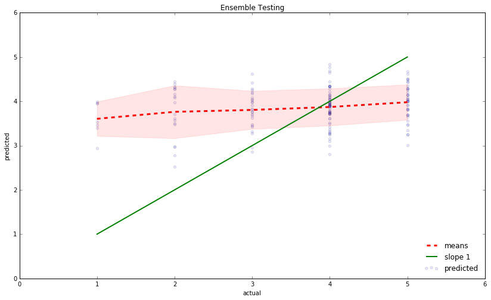

## Contents
{:.no_toc}
*  
{: toc}

## Preferred Models
In our approach to creating a rating system for Yelp users and restaurants, we looked at a number of different models to predict the ratings that certain users would give a certain restaurants.  The approaches we took to create these models were the following: a baseline estimate derived by taking the means of specific user ratings and specific restaurant ratings as bias terms, a baseline estimate derived by using Ridge regression to fit the individual bias terms for each user and each restaurant, a latent factor estimate optimized via an implementation of matrix factorization and stochastic gradient descent, a neighbor model fit using the k-nearest neighbors algorithm, and an ensemble regression method to combine the results of some of the previous models. All of the plots below are predicted-actual scatterplots to compare the actual values in the data to our predicted values.  The dotted red line represents the mean of the predictions at a given actual rating.  The red zone represents a one standard-deviation interval of predicted ratings for a given actual rating.  The better the model is, the more closely the red line should match the green line and the tighter the red zone should be.

### Baseline Model 
Our modeling process began with two baseline estimates.  The first of these two attempted to predict the rating by a given user for a given business via a model of the form $$\hat{Y}_{um} = \mu + \theta_u + \gamma_m$$,where $\hat{Y}_{um}$ represents the rating of restaurant $m$ by user $u$, $\mu$ represents an intercept term, $\theta_u$ represents the bias of user $u$, and $\gamma_m$ represents the bias of restaurant $m$.  For example, a user might be biased in that they tend to generally rate restaurants higher than other users, or a restaurant might be biased in that it tends to be rated lower than other restaurants.

To estimate these biases in this simple baseline, we first took the mean of all ratings to act as the intercept (i.e. a global average).  We then represented the bias of user u as the difference between the average rating of user u and the global average.  We similarly represented the bias of restaurant m as the difference between the average rating of restaurant m and the global average.

### Baseline Model Graphs

### Regularised Regression Model
The second of these two baseline estimates utilized a Ridge regression model to fit for the biases of each user and restaurant via a model of the form $\hat{Y}_{um} = \mu + \bar{\theta} \cdot I_u + \bar{\gamma} \cdot I_m$, where $\bar{\theta} \cdot I_u$ represents a vector of user biases multiplied by an indicator variable of user $u$ and $\bar{\gamma} \cdot I_m$ represents a vector of restaurant biases multipled by an indicator variable of restaurant $m$.

To estimate these bias vectors in the regression baseline, we one-hot encoded the users and businesses in the sample to act as the indicator variables (i.e. the column for user $u$ would have a 1 in rows where the user gave the review, and zeroes elsewhere, and similarly for restaurant m).  We then used sklearn's RidgeCV method to fit the data with a regularized regression model (cross-validated for the optimal regularization parameter) and obtain the vectors of coefficients for each user and each restaurant, as well as obtain an intercept estimate.  We could then use these coefficient estimates and intercept estimates to obtain predicted ratings for given users and restaurants.

### Regularised Regression Model Graphs

### Matrix Factorisation  Model

Our third modeling approach used a latent factor model to attempt to predict ratings based on latent features between users and restaurants.  Latent features are interactions between users and properties of restaurants that may be significant in determining a rating - for example, a user may have a penchant for spicy food or cheap prices.  Given a matrix of restaurant ratings $R$ with users as rows and restaurants as columns, we can attempt to decompose this matrix into the form $P \times Q^T$, where each row of $P$ represents the associations between a user and a latent feature and each row of $Q$ represents the associations between a restaurant and a latent feature.  Of course, we do not know what the numerical values for these associations are - thus, we estimate them through this matrix factorization via optimizing by a stochastic gradient descent method.

In all, we look to minimize the loss function $$e^2_{um} = (Y_{um} - \sum_{k=1}^K{p_{uk}q_{kj}})^2 + \frac{\beta}{2}\sum_{k=1}^K{\|P\|^2 + \|Q^2\|}$$, where the second term represents a regularization to prevent from overfitting on the user and restaurant data in P and Q.  We perform this minimization through an implementation of stochastic gradient descent, which iterates through loops to take the partial gradients for $p$ and $q$, create an update rule for each iteration, and update the values of each $p$ and $q$ according to our previous estimates and the new update rule.  After enough iterations, the process converges on estimates for the latent feature associations, which can be converted back into a full predicted ratings matrix $R$.  The implementation of stochastic gradient descent includes a parameter for "learning rate" ($\alpha$), which denotes how quickly the update rule (found by taking the gradient) attempts to move us towards the optimal weights.  Due to runtime issues, we could not achieve absolute convergence with stochastic gradient descent and limited the number of iterations.

### Matrix Factorisation on Stars Model Graphs

### Matrix Factorisation on Residuals Model Graphs

### K-Nearest Neighbours Model

Our fourth modeling approach used a neighbor model to attempt to predict ratings based on user and restaurant associations with their nearest neighbors.  To implement this neighbor model, we used sklearn's KNeighborsRegressor method, which performs regression based on a k-NN algorithm.  We one-hot encoded the users and restaurants as we did in the Ridge regression model.  We then fit the k-NN regressor on the training set and used it to make predictions for ratings given a specific user and restaurant.

Note that as we increase $k$ here, the slope deviates further from the green line, indicating that the model is less effective
### K-Nearest Neighbours Model Graphs

### Ensemble Model

Our fifth modeling approach applied an ensembling method to combine the results of all of our previous models.  The ensemble method we implemented was a form of stacked regression, where the outputs of the previous models were gathered as predictors and used in a least squares regression on the validation set to deliver a set of weights assigned to each model's outputs.  We then used this regression model to predict ratings for given users and restaurants on the training and validation set, as well as a testing set.

### Ensemble Model Graphs on Training and Validation Sets

### Ensemble Model Graphs on Test Set

## Strengths
Strength of baseline estimate:

The mean baseline estimate model is advantageous in that it is quite simple to calculate and actually has a significant impact on the accuracy of the predictions; in fact, as noted in one of the references by Edwin Chen, an accurate treatment of "those humble baseline predictors" (such as bias terms) was probably at least as significant as any modeling breakthrough made during the Netflix prize competition.

Strength of regularized regression factorization:
    
One strength of a regression baseline model is that thare able to calculate more precise bias estimates than by simply taking the mean for each user's/restaurant's ratings.  Furthermore, the use of cross-validated Ridge regression allows us to include an optimal regularization parameter in order prevent overfitting of the model to the training data (i.e. hopefully the model generalizes better to out-of-sample sets).

Strength of the latent factor model:
    
The latent factor model has the advantage of being a hardcore machine learning-style approach to this problem in the sense that it is able to account for a number of important features in the data that are near impossible for us to find otherwise.  For example, it would be extremely difficult for us to make empirical estimates for the association between a user and food spiciness; however, an algorithm such as stochastic gradient descent can create a "latent factor space" which, while difficult for us to interpret, is able to make estimates for such latent features that can boost accuracy.

Strength of the neighbor model:
    
The neighbour model is advantageous in that it allows for us to define similarities between in a more concrete way than, say, a matrix factorization method - it takes users or items that are similar (by some metric) to the user or item we are attempting to predict, and takes the means of those ratings.  In addition, the ability to implement k-NN as our method in the model gives us a fairly simplistic and nonparametric method, meaning that we don't have to worry about certain assumptions that a regression model might make about the data.

Strength of the ensemble model:

The strength of the ensemble model is that, by utilizing the outputs from all of the previous models, we may be able to average out the biases of each individual method.  These biases could result from overfitting issues, parameter issues, or simply structural issues within the models themselves - once all are combined with their separate biases, however, we would hope that some of the overall bias is mitigated.

## Shortcomings
Each model has its own weaknesses to consider, and certainly no model achieved results that are particularly noteworthy in terms of their accuracy.  Both of the baseline models are unable to account for important features present in some of the other two models, such as neighboring factors or latent features.  Of course, computational intensity is an issue, leaving us to consider a fairly small number of latent features in our latent factor model (and to limit the number of steps towards convergence for stochastic gradient descent to around forty, when the ideal number would probably be in the thousands).  For the neighbor model, our training data may not have been large enough to fully take advantage of the k-NN algorithm.  For the ensemble method, if some of our models were much better than some of our other ones, then the results of the good models may have been diluted by their ensembling with the bad models.

All of the above are just some examples of how models could have gone wrong and point to avenues for improvement in the future.

## Project Trajectory
Our project goal stayed fairly similar throughout: build a model to predict Yelp ratings given specific users and specific ratings.  However, some of our implementation methods did change based on and some difficulties with computational intensity.  While the Yelp dataset provided is enormous, we had to use a very small subset of the data due to issues with available memory and computational intensity of some of these methods.  And, while we originally planned to optimize the matrix factorization approach through ALS, we ended up using While ALS had a comparable and sometimes better MSE, the ALS method returned estimates very close to 3.50 (not straying below 3.0, in some cases).  In fact, we got a similar MSE to our ALS method by using an array  filled with nothing but predicted ratings of 3.50 and got a very similar MSE to our ALS approach!  Thus, we implemented the stochastic gradient descent method as we felt it would be more interesting to consider.  

One last aspect of our project that switched trajectories was considering whether to use matrix factorization to predict our baseline residuals or to predict the ratings directly.  Through a number of online and provided resources, it appeared that inputting the ratings directly into the matrix to be factorized (as opposed to the residuals from the baseline estimate) would be more feasible and return stronger results.  In the final analysis, we included both methods. 

## Moving Forward
One of the most significant bottlenecks we faced in the development of this prediction model was time. The dataset was very large (`review.json` was originally 3.8 GB and `user.json` was 1.6 GB) and many of the models we ran took hours to finish even on a significantly smaller subsample. Furthermore, in our kNN and matrix factorization models, we saw significant increases in performance in the validation set with larger numbers of nearest neighbors and latent factors but these were associated with longer runtimes as well, forcing us to use smaller parameters than what we believe would have been optimal. With more time or computational power, we would have run these models with better parameters and on more data.

Another interesting next step would be to look at more predictors than just `user_id` and `business_id`. Although `stars_biz` and `average_stars_usr` were by far the best predictors (as shown by our heatmap), there were other dimensions that could have added more insight, such as data like`total_checkins`, interaction terms, and temporal dimensions.

