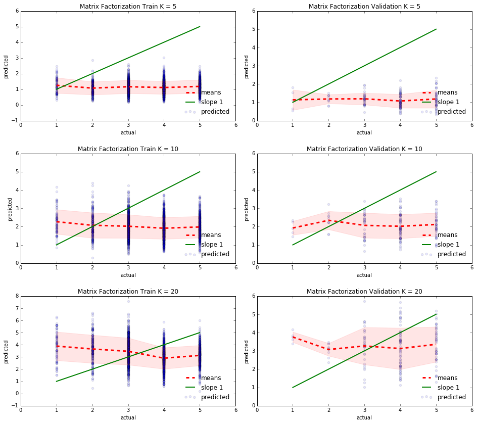

## Contents
{:.no_toc}
*
{: toc}

## Preferred Models
In our approach to creating a rating system for Yelp users and restaurants, we looked at a number of different models to predict the ratings that certain users would give a certain restaurants.  The approaches we took to create these models were the following: a baseline estimate derived by taking the means of specific user ratings and specific restaurant ratings as bias terms, a baseline estimate derived by using Ridge regression to fit the individual bias terms for each user and each restaurant, a latent factor estimate optimized via an implementation of matrix factorization and stochastic gradient descent, a neighbor model fit using the k-nearest neighbors algorithm, and an ensemble regression method to combine the results of some of the previous models.

### Baseline Model 
Our modeling process began with two baseline estimates.  The first of these two attempted to predict the rating by a given user for a given business via a model of the form $$\hat{Y}_{um} = \mu + \theta_u + \gamma_m$$,where $\hat{Y}_{um}$ represents the rating of restaurant m by user u, $\mu$ represents an intercept term, $\theta_u$ represents the bias of user u, and $\gamma_m$ represents the bias of restaurant m.  For example, a user might be biased in that they tend to generally rate restaurants higher than other users, or a restaurant might be biased in that it tends to be rated lower than other restaurants.

To estimate these biases in this simple baseline, we first took the mean of all ratings to act as the intercept (i.e. a global average).  We then represented the bias of user u as the difference between the average rating of user u and the global average.  We similarly represented the bias of restaurant m as the difference between the average rating of restaurant m and the global average.

### Baseline Model Graphs

### Regularised Regression Model
The second of these two baseline estimates utilized a Ridge regression model to fit for the biases of each user and restaurant via a model of the form $\hat{Y}_{um} = \mu + \bar{\theta} \cdot I_u + \bar{\gamma} \cdot I_m$, where $\bar{\theta} \cdot I_u$ represents a vector of user biases multiplied by an indicator variable of user u and $\bar{\gamma} \cdot I_m$ represents a vector of restaurant biases multipled by an indicator variable of restaurant m.

To estimate these bias vectors in the regression baseline, we one-hot encoded the users and businesses in the sample to act as the indicator variables (i.e. the column for user u would have a 1 in rows where the user gave the review, and zeroes elsewhere, and similarly for restaurant m).  We then used sklearn's RidgeCV method to fit the data with a regularized regression model (cross-validated for the optimal regularization parameter) and obtain the vectors of coefficients for each user and each restaurant, as well as obtain an intercept estimate.  We could then use these coefficient estimates and intercept estimates to obtain predicted ratings for given users and restaurants.

### Regularised Regression Model Graphs

### Matrix Factorisation on Stars Model Graphs

### Matrix Factorisation on Residuals Model Graphs

### K Nearest Neighbours Model Graphs

### Ensemble Model Graphs on Training and Validation Sets

### Ensemble Model Graphs on Test Set

## Strengths

## Shortcomings

## Moving Forward

Dan's funky multicoloured sentence

