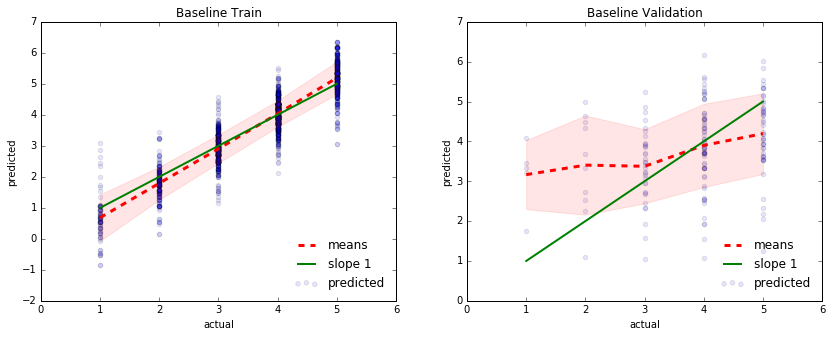
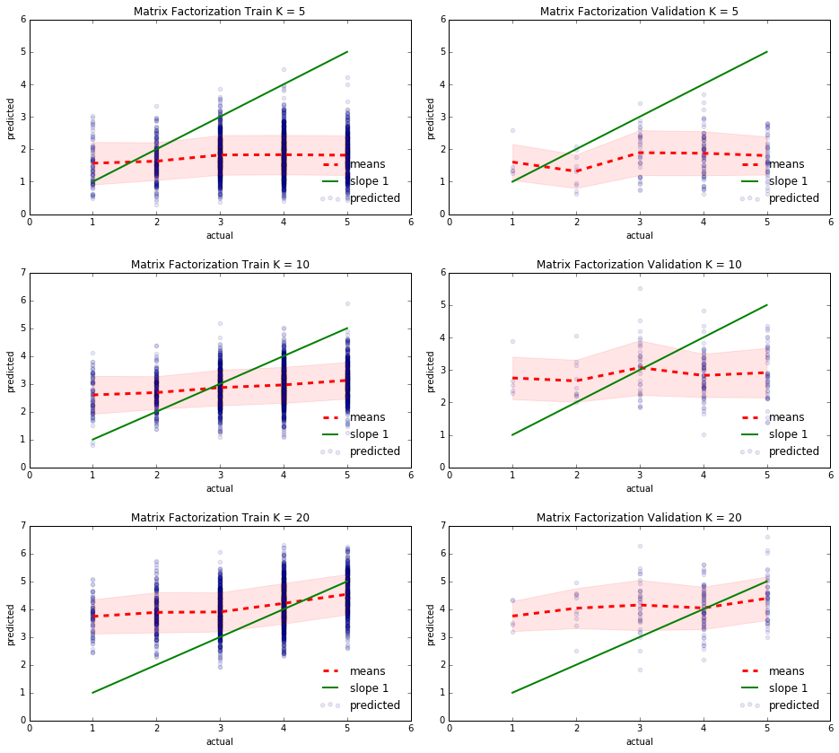
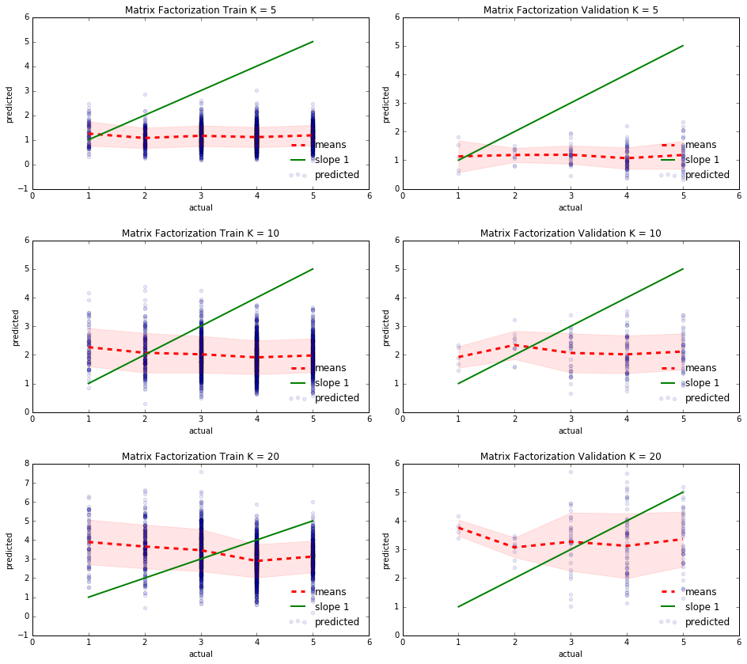
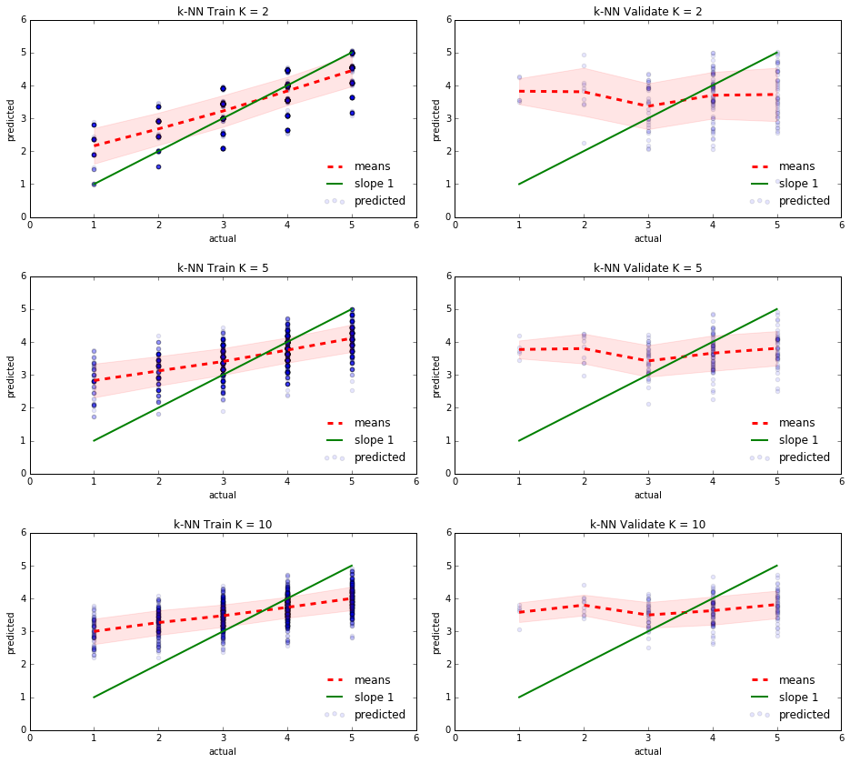
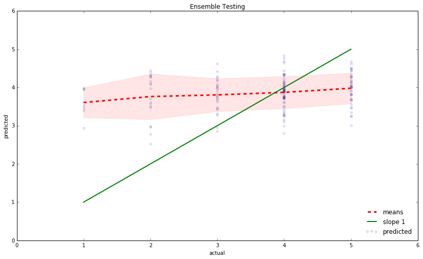

```python
import numpy as np
import pandas as pd
import scipy as sp
from sklearn.linear_model import LinearRegression
from sklearn.neighbors import NearestNeighbors
import statsmodels.regression.linear_model as sm
from sklearn.linear_model import RidgeCV
from sklearn.linear_model import LassoCV
import sklearn.metrics as metrics
import matplotlib
import matplotlib.pyplot as plt
import seaborn as sns
plt.style.use('classic')
%matplotlib inline

np.random.seed(100)
```


# READING IN DATA


```python
# reading in business and checkin data in their entiretiy
df_biz = pd.read_json('data/business.json', lines = True)
df_check = pd.read_json('data/checkin.json', lines = True)
```


```python
# review and user files are too large to read in through pandas - take random samples here

sample_rvw = []
sample_usr = []

# read each line from review.json with 10% probability
with open('data/review.json', 'r', encoding = 'utf8') as f:
    for line in f:
        if np.random.uniform() < 0.1:
            sample_rvw.append(line.strip())

# write those lines into a new file for pandas to read
with open('data/sample_review.json', 'w', encoding = 'utf8') as f:
    for line in sample_rvw:
        print(line, file = f)

# read smaller file using pandas
df_review_samp = pd.read_json('data/sample_review.json', lines = True)
```


```python
# read each line from user.json with 10% probability
with open('data/user.json', 'r', encoding = 'utf8') as f:
    for line in f:
        if np.random.uniform() < 0.1:
            sample_usr.append(line.strip())

# write those lines into a new file for pandas to read
with open('data/sample_user.json', 'w', encoding = 'utf8') as f:
    for line in sample_usr:
        print(line, file = f)
        
df_usr_samp = pd.read_json('data/sample_user.json', lines = True)
```


```python
print("The total number of users read in is: ", df_usr_samp.shape[0])
print("The total number of reviews read in is: ", df_review_samp.shape[0])
```


    The total number of users read in is:  118848
    The total number of reviews read in is:  472894
    

# CLEANING DATA


```python
# get users that are represented in the review sample at least 10 times
df_usr_subset = df_usr_samp[df_usr_samp['user_id'].isin(df_review_samp['user_id'])]

# pare reviews down to those which have user data
df_rvw_subset = df_review_samp[df_review_samp['user_id'].isin(df_usr_subset['user_id'])]

# now we have two dataframes, each with same users, one has user data and the other has review data

# get business and check data corresponding to what reviews we have in the sample
df_biz_subset = df_biz[df_biz['business_id'].isin(df_rvw_subset['business_id'])]
df_check_subset = df_check[df_check['business_id'].isin(df_biz_subset['business_id'])]
```


```python
# 27631 unique businesses out of 47691 total reviews
print("The total number of unique recorded businesses in this sample is: ", len(df_rvw_subset['business_id'].unique()))
print("The total number of unique recorded users in this sample is: ", len(df_usr_subset['user_id'].unique()))
print("The total number of recorded reviews in this sample is: ", df_rvw_subset.shape[0])
```


    The total number of unique recorded businesses in this sample is:  27403
    The total number of unique recorded users in this sample is:  27631
    The total number of recorded reviews in this sample is:  47691
    

After checking for abnormalities (objects that should be floats, missing values, etc.) we conclude that nothing looks too strange and that we can continue with our manipulation.


    address          object
    attributes       object
    business_id      object
    categories       object
    city             object
    hours            object
    is_open           int64
    latitude        float64
    longitude       float64
    name             object
    neighborhood     object
    postal_code      object
    review_count      int64
    stars           float64
    state            object
    dtype: object


    business_id            object
    cool                    int64
    date           datetime64[ns]
    funny                   int64
    review_id              object
    stars                   int64
    text                   object
    useful                  int64
    user_id                object
    dtype: object


    average_stars         float64
    compliment_cool         int64
    compliment_cute         int64
    compliment_funny        int64
    compliment_hot          int64
    compliment_list         int64
    compliment_more         int64
    compliment_note         int64
    compliment_photos       int64
    compliment_plain        int64
    compliment_profile      int64
    compliment_writer       int64
    cool                    int64
    elite                  object
    fans                    int64
    friends                object
    funny                   int64
    name                   object
    review_count            int64
    useful                  int64
    user_id                object
    yelping_since          object
    dtype: object


    business_id    0
    cool           0
    date           0
    funny          0
    review_id      0
    stars          0
    text           0
    useful         0
    user_id        0
    dtype: int64


    address         0
    attributes      0
    business_id     0
    categories      0
    city            0
    hours           0
    is_open         0
    latitude        0
    longitude       0
    name            0
    neighborhood    0
    postal_code     0
    review_count    0
    stars           0
    state           0
    dtype: int64


    average_stars         0
    compliment_cool       0
    compliment_cute       0
    compliment_funny      0
    compliment_hot        0
    compliment_list       0
    compliment_more       0
    compliment_note       0
    compliment_photos     0
    compliment_plain      0
    compliment_profile    0
    compliment_writer     0
    cool                  0
    elite                 0
    fans                  0
    friends               0
    funny                 0
    name                  0
    review_count          0
    useful                0
    user_id               0
    yelping_since         0
    dtype: int64


```python
# this dataframe contains every review, paired with the user who gave the review and the business that was reviewed
df_rvw_usr = df_usr_subset.merge(df_rvw_subset, on = 'user_id', how = 'left')

# this dataframe contains every review, user giving the review, and characteristics of business being reviewed
# each row represents a review
df_rvw_usr_biz = df_rvw_usr.merge(df_biz_subset, on = 'business_id', how = 'left')

# add in total checkin data for each restaurant (measure of popularity)
dict_checkins = {}

for index, row in df_check_subset.iterrows():
    for key in row['time'].keys(): 
        dict_checkins[row['business_id']] = np.sum(list(row['time'][key].values()))

checkin_series = pd.Series(dict_checkins, name = 'total_checkins')
df_check_merger = pd.DataFrame(checkin_series).reset_index()
df_check_merger.columns = ['business_id', 'total_checkins']

# this df contains all user, review, biz, and checkin data
df_all = df_rvw_usr_biz.merge(df_check_merger, on = 'business_id', how = 'left')

# there is not checkin data for some businesses - choosing to fill those with zeroes
df_all.fillna(0, inplace = True)

# confirmation that every original review in the subset is contained in this dataframe
print(df_all.shape[0] == df_rvw_subset.shape[0])
```


    True
    


```python
# dropping predictors

# drop latitude, longitude, neighborhood - too specific for predictors (stick with state,city as location identifiers)
# we're tracking names by user ids and restaurant ids, so we can drop names
# drop neighborhood since most entries don't have values

df_all.drop(['name_x', 'name_y', 'latitude', 'longitude', 'neighborhood'], axis = 1, inplace = True)

# rename columns to remove user, review, business ambiguity (some colnames were the same)
df_all.columns = ['average_stars_usr', 'compliment_cool', 'compliment_cute',
       'compliment_funny', 'compliment_hot', 'compliment_list',
       'compliment_more', 'compliment_note', 'compliment_photos',
       'compliment_plain', 'compliment_profile', 'compliment_writer', 'cool_usr',
       'elite', 'fans', 'friends', 'funny_usr', 'review_count_usr', 'useful_usr',
       'user_id', 'yelping_since', 'business_id', 'cool_rvw', 'date', 'funny_rvw',
       'review_id', 'stars_rvw', 'text', 'useful_rvw', 'address', 'attributes',
       'categories', 'city', 'hours', 'is_open', 'postal_code',
       'review_count_biz', 'stars_biz', 'state', 'total_checkins']
```


```python
# get reviews of restaurants within desired categories
def get_desired_restaurants(df, category_list):
    desired_rows = []

    for row in df.iterrows():
        for cat in category_list:
            # get row if it is in the correct category
            if cat in row[1]['categories']:
                desired_rows.append(row[1])

    df_desired = pd.DataFrame(desired_rows)

    # drop duplicates from multiple categories
    df_desired = df_desired[df_desired['review_id'].duplicated() == False]
    return(df_desired)        
```


```python
# get subset of this dataframe that contains only restaurants/food stores
df_rest_all = get_desired_restaurants(df_all, ['Food', 'Restaurants'])
```


```python
# trimming the dataframe to only include reviews from users who have at least 5 restaurant reviews in our random sample
usr_rvw_appearances = df_rest_all['user_id'].value_counts()
df_rest = df_rest_all[df_rest_all['user_id'].isin(usr_rvw_appearances[usr_rvw_appearances>=10].index)]
```


```python
# unique restaurants here
print("The number of unique restaurants in this sample is: ", len(df_rest['business_id'].unique()))
print("The number of unique users in this sample is: ", len(df_rest['user_id'].unique()))
print("The number of reviews in this sample is: ", df_rest.shape[0])
```


    The number of unique restaurants in this sample is:  3808
    The number of unique users in this sample is:  253
    The number of reviews in this sample is:  4398
    

# TRAIN - VALIDATE - TEST SPLIT

We now split the data into three distinct partitions: `df_train`, `df_validate`, and `df_test`. Our individual models will all be fit on `df_train`, parameters tuned on `df_validate` (cross-validation proved too computationally heavy to be worth it), and finally evaluated on `df_test`. To preserve the integrity of the testing set we will not look at any results or train any models on the data and only use it to evaluate our ensemble and indivdual models at the very end.

Furthermore, because we are predicting reviews based on the user and business involved, it helps a lot to have some continuity in terms of these variables between the three partitions. To do this we split the sets by first grouping the original data by `user_id` and then sampling from these groups. This ensures every user is featured in every partition. Then we cut all reviews from the validation and testing sets that are for businesses not featured in the training set.


```python
# split halfway into placeholder dataframe and training set
df_temp = df_rest.groupby('user_id', group_keys=False).apply(lambda x: x.sample(frac = 0.50))
df_train = df_rest[~df_rest.isin(df_temp)].dropna()

# split placeholder df into test and validate
df_test = df_temp.groupby('user_id', group_keys=False).apply(lambda x: x.sample(frac = 0.5))
df_validate = df_temp[~df_temp.isin(df_test)].dropna()
```


```python
# drop reviews from test and validate that are for businesses that are not in the training set
df_test = df_test[df_test['business_id'].isin(df_train['business_id'])].dropna()
df_validate = df_validate[df_validate['business_id'].isin(df_train['business_id'])].dropna()

print (len(df_train), len(df_validate), len(df_test))
```


    2194 163 157
    

# BASELINE MODEL


```python
# function to get baseline mean model given training and test dataframes
def baseline_model(df_train, df_test):
    # intercept is defined as mean of all reviews
    global_est = df_train['stars_rvw'].mean()
    # user bias is mean of all reviews for a specific user, minus the global mean
    user_biases = df_train.groupby('user_id')['stars_rvw'].mean() - global_est
    # business bias is mean of all reviews for a specific business, minus the global mean
    rest_biases = df_train.groupby('business_id')['stars_rvw'].mean() - global_est
    
    gamma = rest_biases[df_test['business_id']].dropna()
    theta = user_biases[df_test[df_test['business_id'].isin(gamma.index)]['user_id']].dropna()

    # the prediction is the global mean plus the biases for the user and business
    prediction = global_est + theta.values + gamma.values
        
    return pd.DataFrame([df_test['user_id'].values, df_test['business_id'].values, 
                         prediction, df_test['stars_rvw'].values],
                         index = ['user_id','business_id','pred','actual'], columns = df_test.index).T

# get baseline estimates for all three datasets
baseline_results_train = baseline_model(df_train, df_train)
baseline_results_validate = baseline_model(df_train, df_validate)
baseline_results_test = baseline_model(df_train, df_test)
```


```python
baseline_results_train.head()
```


<div>
<style>
    .dataframe thead tr:only-child th {
        text-align: right;
    }

    .dataframe thead th {
        text-align: left;
    }

    .dataframe tbody tr th {
        vertical-align: top;
    }
</style>
<table border="1" class="dataframe">
  <thead>
    <tr style="text-align: right;">
      <th></th>
      <th>user_id</th>
      <th>business_id</th>
      <th>pred</th>
      <th>actual</th>
    </tr>
  </thead>
  <tbody>
    <tr>
      <th>53</th>
      <td>Znid_azpcHmdRMHGicmkWA</td>
      <td>vOfz55MmWgjNQ3BA2PnhgQ</td>
      <td>2.76768</td>
      <td>3</td>
    </tr>
    <tr>
      <th>57</th>
      <td>Znid_azpcHmdRMHGicmkWA</td>
      <td>jhIVSxvjRUn_r-1CUq8taw</td>
      <td>3.76768</td>
      <td>4</td>
    </tr>
    <tr>
      <th>58</th>
      <td>Znid_azpcHmdRMHGicmkWA</td>
      <td>bUEc1ZDgfZPymHyUXEiiNg</td>
      <td>2.76768</td>
      <td>3</td>
    </tr>
    <tr>
      <th>59</th>
      <td>Znid_azpcHmdRMHGicmkWA</td>
      <td>gTw6PENNGl68ZPUpYWP50A</td>
      <td>2.76768</td>
      <td>3</td>
    </tr>
    <tr>
      <th>60</th>
      <td>Znid_azpcHmdRMHGicmkWA</td>
      <td>NOfbzTpQ7hrt6ZbJVeXUUw</td>
      <td>1.76768</td>
      <td>2</td>
    </tr>
  </tbody>
</table>
</div>


```python
# function to plot model predictions as compared to what predictions should be
# the better the model is, the closer the dotted red line is to the green line
# the red zone represents a 1 SD interval of predicted ratings for a given actual rating

def show_results_RMSE(pred, actual, name = '', ax = None):
    
    if ax == None:
        ax = plt.gca()
    
    results = pd.DataFrame([pred, actual], index = ['pred','actual']).T
    means = [np.mean(results['pred'][results['actual'] == x]) for x in range(1,6)]
    stds = pd.DataFrame(results[['pred','actual']], dtype=float).groupby('actual')['pred'].std().values

    ax.scatter(results['actual'], results['pred'], alpha =0.1, label = 'predicted');
    ax.plot(range(1,6), means, label = 'means', linestyle = '--', linewidth = 3, c='r');
    ax.plot(range(1,6), range(1,6), label = 'slope 1', linewidth = 2, c='g');
    ax.fill_between(range(1,6), means - stds, means + stds, color='r', alpha=0.1)
    
    ax.set_xlabel('actual')
    ax.set_ylabel('predicted')
    ax.set_title(name)
    ax.legend(loc='lower right', frameon=False);
    
    print (name, 'RMSE', np.sqrt(metrics.mean_squared_error(actual, pred)))
    return np.sqrt(metrics.mean_squared_error(actual, pred))
```


```python
# plots for training set and validation set baseline models

fig, ax = plt.subplots(nrows=1, ncols=2, figsize = (14,5))

show_results_RMSE(baseline_results_train['pred'], 
                  baseline_results_train['actual'], 
                  ax = ax[0], name = 'Baseline Train');

show_results_RMSE(baseline_results_validate['pred'], 
                  baseline_results_validate['actual'], 
                  ax = ax[1], name = 'Baseline Validation');
```


    Baseline Train RMSE 0.499476294474
    Baseline Validation RMSE 1.22260770083
    





# REGULARIZED REGRESSION


```python
# function to get regularized regression baseline estimates given training and test dataframes
def baseline_model_regression(df_train, df_test):
    # one hot encode IDs to act as indicator variables in the regression
    oh_train = pd.get_dummies(df_train[['user_id','business_id','stars_rvw']], columns = ['user_id','business_id'])
    oh_test = pd.get_dummies(df_test[['user_id','business_id','stars_rvw']], columns = ['user_id','business_id'])
    ids = oh_train.columns[1:].values
    
    # get coefficients for each user and business
    ridge_model = RidgeCV(fit_intercept=True).fit(oh_train[ids], oh_train['stars_rvw'].values.reshape(-1,1))
    ridge_coefs = pd.Series(ridge_model.coef_[0], index = oh_train[ids].columns.values)
    ridge_intercept = ridge_model.intercept_
    
    # make model predictions
    prediction = (oh_test.iloc[:,1:]*ridge_coefs).sum(axis=1) + ridge_intercept
    
    # return dataframe with relevant info
    return pd.DataFrame([df_test['user_id'].values, df_test['business_id'].values, 
                         prediction, df_test['stars_rvw'].values],
                         index = ['user_id','business_id','pred','actual'], columns = df_test.index).T

# perform regression baseline estimates on training, validation, test sets
baseline_regression_results_test = baseline_model_regression(df_train, df_test)
baseline_regression_results_validate = baseline_model_regression(df_train, df_validate)
baseline_regression_results_train = baseline_model_regression(df_train, df_train)
```


```python
baseline_regression_results_train.head()
```


<div>
<style>
    .dataframe thead tr:only-child th {
        text-align: right;
    }

    .dataframe thead th {
        text-align: left;
    }

    .dataframe tbody tr th {
        vertical-align: top;
    }
</style>
<table border="1" class="dataframe">
  <thead>
    <tr style="text-align: right;">
      <th></th>
      <th>user_id</th>
      <th>business_id</th>
      <th>pred</th>
      <th>actual</th>
    </tr>
  </thead>
  <tbody>
    <tr>
      <th>53</th>
      <td>Znid_azpcHmdRMHGicmkWA</td>
      <td>vOfz55MmWgjNQ3BA2PnhgQ</td>
      <td>3.53171</td>
      <td>3</td>
    </tr>
    <tr>
      <th>57</th>
      <td>Znid_azpcHmdRMHGicmkWA</td>
      <td>jhIVSxvjRUn_r-1CUq8taw</td>
      <td>3.62262</td>
      <td>4</td>
    </tr>
    <tr>
      <th>58</th>
      <td>Znid_azpcHmdRMHGicmkWA</td>
      <td>bUEc1ZDgfZPymHyUXEiiNg</td>
      <td>3.53171</td>
      <td>3</td>
    </tr>
    <tr>
      <th>59</th>
      <td>Znid_azpcHmdRMHGicmkWA</td>
      <td>gTw6PENNGl68ZPUpYWP50A</td>
      <td>3.53171</td>
      <td>3</td>
    </tr>
    <tr>
      <th>60</th>
      <td>Znid_azpcHmdRMHGicmkWA</td>
      <td>NOfbzTpQ7hrt6ZbJVeXUUw</td>
      <td>3.4408</td>
      <td>2</td>
    </tr>
  </tbody>
</table>
</div>


```python
# plot regression baseline model accuracy for training and validation sets

fig, ax = plt.subplots(nrows=1, ncols=2, figsize = (14,5))

show_results_RMSE(baseline_regression_results_train['pred'], 
                  baseline_regression_results_train['actual'], 
                  ax = ax[0], name = 'Ridge Baseline Train');

show_results_RMSE(baseline_regression_results_validate['pred'], 
                  baseline_regression_results_validate['actual'], 
                  ax = ax[1], name = 'Ridge Baseline Validation');
```


    Ridge Baseline Train RMSE 0.870320881605
    Ridge Baseline Validation RMSE 1.00784087905
    


```python
# now that we have baseline predictions and their respective residuals, we can add them to all sets

df_train['baseline_residual'] = (baseline_regression_results_train['actual'] - \
                                baseline_regression_results_train['pred']).astype(float)
df_train['baseline_pred'] = baseline_regression_results_train['pred'].astype(float)

df_validate['baseline_residual'] = (baseline_regression_results_validate['actual'] - \
                                   baseline_regression_results_validate['pred']).astype(float)
df_validate['baseline_pred'] = baseline_regression_results_validate['pred'].astype(float)

df_test['baseline_residual'] = (baseline_regression_results_test['actual'] - \
                               baseline_regression_results_test['pred']).astype(float)
df_test['baseline_pred'] = baseline_regression_results_test['pred'].astype(float)
```


# MATRIX FACTORIZATION - TRAIN/TEST - STARS

We will first try matrix factorization using the observed rating as our response variable. We will train models on `df_train` using `[5, 10, 20]` latent factors and choose the best one based on performance within the validation set.


```python
"""
latent_feature_estimates()

Parameters:
    R     : a matrix to be factorized, dimension N x M
    P     : an initial matrix of dimension N x K
    Q     : an initial matrix of dimension M x K
    K     : the number of latent features
    steps : the maximum number of steps to perform the optimisation (higher = closer to convergence)
    alpha : the learning rate
    beta  : the regularization parameter
Returns:
    the final matrices P and Q
"""

def latent_feature_estimates(R, P, Q, K, steps=40, alpha=0.0002, beta=0.02):
    # track progress
    count = 0
    loader = round(steps/20)
    Q = Q.T
    
    for step in range(steps):
        count += 1
        if count%loader==0:
            progress = int(count/loader)
            bar = ''
            for i in range(progress):
                bar = bar + '#'
            space = ''
            for j in range(20-progress):
                space = space + ' '
            print("Loading Bar: [", bar, space, "]", end="\r", flush=True)
        # begin iteration through original ratings matrixs
        for i in range(len(R)):
            for j in range(len(R[i])):
                # find if actual rating exists in this position
                if R[i][j] > 0:
                    # get error estimate
                    eij = R[i][j] - np.dot(P[i,:],Q[:,j])
                    # optimize P, Q for this iteration given our error for this iteration
                    for k in range(K):
                        P[i][k] = P[i][k] + alpha * (2 * eij * Q[k][j] - beta * P[i][k])
                        Q[k][j] = Q[k][j] + alpha * (2 * eij * P[i][k] - beta * Q[k][j])
        eR = np.dot(P,Q)
        e = 0
        # regularize to modify squared error (prevent overfitting)
        for i in range(len(R)):
            for j in range(len(R[i])):
                if R[i][j] > 0:
                    e = e + pow(R[i][j] - np.dot(P[i,:],Q[:,j]), 2)
                    for k in range(K):
                        e = e + (beta/2) * ( pow(P[i][k],2) + pow(Q[k][j],2) )
        # determine when to break loop if convergence reached
        if e < 0.001:
            break
    print ("Loading Bar: [ ####################  ]", end='')
    print ("  DONE!")
    return P, Q.T

"""
matrix_factorization()

Parameters:
    df_train = sample of review data on which to perform matrix factorization
    K = # of latent features to include.
Returns:
    Dataframe of predicted ratings.
"""
def matrix_factorization(df_train, K = 2):
    # need to convert train data into (user_id X business_id) matrices containing known star ratings
    df_ids_stars_train = df_train[['user_id', 'business_id', 'stars_rvw']]
    df_matrix_train = df_ids_stars_train.pivot_table(columns=['business_id'],index=['user_id'],values='stars_rvw')
    df_matrix_train.fillna(0, inplace = True)

    R = df_matrix_train.as_matrix()

    N = len(R)
    M = len(R[0])
    
    # starting junk values for associations
    P = np.random.rand(N,K)
    Q = np.random.rand(M,K)

    # latent feature estimates
    nP, nQ = latent_feature_estimates(R, P, Q, K)

    # predicted ratings matrix
    nR = np.dot(nP, nQ.T)

    return pd.DataFrame(nR, index = df_matrix_train.index, columns = df_matrix_train.columns)
    
mf_results_5 = matrix_factorization(df_train, K = 5)
mf_results_10 = matrix_factorization(df_train, K = 10)
mf_results_20 = matrix_factorization(df_train, K = 20)
```


    Loading Bar: [ ####################  ]  DONE!
    Loading Bar: [ ####################  ]  DONE!
    Loading Bar: [ ####################  ]  DONE!
    


```python
# takes output of matrix factorization and pulls results that can be compared from the reviews to calculate MSE
def mf_results_converter(mf_results, df_test):    
    # DF_TEST USERS AND BUSINESSES MUST BE SUBSET OF DF_TRAIN (we ensured this during our train-test-validate split)
    # need to convert test data into (user_id X business_id) matrices containing known star ratings
    df_ids_stars_test = df_test[['user_id', 'business_id', 'stars_rvw']]
    df_matrix_test = df_ids_stars_test.pivot_table(columns=['business_id'],index=['user_id'],values='stars_rvw')
    df_matrix_test.fillna(0, inplace = True)
    
    # find positions for which there are review ratings
    test_msk = df_matrix_test.unstack().values !=0
    # get prediction values where the original dataset has review ratings
    prediction = mf_results.unstack()[df_matrix_test.unstack().index][test_msk].values
    
    return pd.DataFrame([df_test['user_id'].values, df_test['business_id'].values, 
                         prediction, df_matrix_test.unstack()[test_msk]],
                         index = ['user_id','business_id','pred','actual'], columns = df_test.index).T

# get results for different numbers of features on train, validation, test set
mf_results_train_5 = mf_results_converter(mf_results_5, df_train)
mf_results_train_10 = mf_results_converter(mf_results_10, df_train)
mf_results_train_20 = mf_results_converter(mf_results_20, df_train)

mf_results_validate_5 = mf_results_converter(mf_results_5, df_validate)
mf_results_validate_10 = mf_results_converter(mf_results_10, df_validate)
mf_results_validate_20 = mf_results_converter(mf_results_20, df_validate)

mf_results_test_5 = mf_results_converter(mf_results_5, df_test)
mf_results_test_10 = mf_results_converter(mf_results_10, df_test)
mf_results_test_20 = mf_results_converter(mf_results_20, df_test)
```


```python
mf_results_train_5.head()
```


<div>
<style>
    .dataframe thead tr:only-child th {
        text-align: right;
    }

    .dataframe thead th {
        text-align: left;
    }

    .dataframe tbody tr th {
        vertical-align: top;
    }
</style>
<table border="1" class="dataframe">
  <thead>
    <tr style="text-align: right;">
      <th></th>
      <th>user_id</th>
      <th>business_id</th>
      <th>pred</th>
      <th>actual</th>
    </tr>
  </thead>
  <tbody>
    <tr>
      <th>53</th>
      <td>Znid_azpcHmdRMHGicmkWA</td>
      <td>vOfz55MmWgjNQ3BA2PnhgQ</td>
      <td>2.68095</td>
      <td>4</td>
    </tr>
    <tr>
      <th>57</th>
      <td>Znid_azpcHmdRMHGicmkWA</td>
      <td>jhIVSxvjRUn_r-1CUq8taw</td>
      <td>1.83293</td>
      <td>3</td>
    </tr>
    <tr>
      <th>58</th>
      <td>Znid_azpcHmdRMHGicmkWA</td>
      <td>bUEc1ZDgfZPymHyUXEiiNg</td>
      <td>3.09917</td>
      <td>5</td>
    </tr>
    <tr>
      <th>59</th>
      <td>Znid_azpcHmdRMHGicmkWA</td>
      <td>gTw6PENNGl68ZPUpYWP50A</td>
      <td>3.79196</td>
      <td>4</td>
    </tr>
    <tr>
      <th>60</th>
      <td>Znid_azpcHmdRMHGicmkWA</td>
      <td>NOfbzTpQ7hrt6ZbJVeXUUw</td>
      <td>1.95872</td>
      <td>5</td>
    </tr>
  </tbody>
</table>
</div>


```python
# plot model predictions for training and validation sets over different numbers of features

fig, ax = plt.subplots(nrows=3, ncols=2, figsize = (16,14))
plt.subplots_adjust(wspace=0.1, hspace=0.3)

print('\nK = 5')
show_results_RMSE(mf_results_train_5['pred'], 
                  mf_results_train_5['actual'], 
                  ax = ax[0,0], name = 'Matrix Factorization Train K = 5');

show_results_RMSE(mf_results_validate_5['pred'], 
                  mf_results_validate_5['actual'], 
                  ax = ax[0,1], name = 'Matrix Factorization Validation K = 5');
print('\nK = 10')
show_results_RMSE(mf_results_train_10['pred'], 
                  mf_results_train_10['actual'], 
                  ax = ax[1,0], name = 'Matrix Factorization Train K = 10');

show_results_RMSE(mf_results_validate_10['pred'], 
                  mf_results_validate_10['actual'], 
                  ax = ax[1,1], name = 'Matrix Factorization Validation K = 10');
print('\nK = 20')
show_results_RMSE(mf_results_train_20['pred'], 
                  mf_results_train_20['actual'], 
                  ax = ax[2,0], name = 'Matrix Factorization Train K = 20');

show_results_RMSE(mf_results_validate_20['pred'], 
                  mf_results_validate_20['actual'], 
                  ax = ax[2,1], name = 'Matrix Factorization Validation K = 20');
```


    
    K = 5
    Matrix Factorization Train K = 5 RMSE 2.18872356196
    Matrix Factorization Validation K = 5 RMSE 2.34448569171
    
    K = 10
    Matrix Factorization Train K = 10 RMSE 1.3169083982
    Matrix Factorization Validation K = 10 RMSE 1.56746045854
    
    K = 20
    Matrix Factorization Train K = 20 RMSE 1.17794606855
    Matrix Factorization Validation K = 20 RMSE 1.21605091857
    





`K = 20` latent factors performed the best.

# MATRIX FACTORIZATION - TRAIN/TEST - RESIDUALS

We will now try matrix factorization using baseline residuals as our response variable. We will train models on `df_train` using `[5, 10, 20]` latent factors and choose the best one based on performance within the validation set.


```python
'''
Performs matrix factorization in the same fashion as the previous matrix_factorization function, but takes
matrix of residuals from baseline estimates instead of matrix of ratings and performs prediction.
'''
def matrix_factorization_resid(df_train, K = 2):
    # need to convert train data into (user_id X business_id) matrices containing known star ratings
    df_ids_residual_train = df_train[['user_id', 'business_id', 'baseline_residual']]
    df_matrix_train = df_ids_residual_train.pivot_table(columns=['business_id'],
                                                        index=['user_id'],
                                                        values='baseline_residual')
    df_matrix_train.fillna(0, inplace = True)

    R = df_matrix_train.as_matrix()

    N = len(R)
    M = len(R[0])
    
    P = np.random.rand(N,K)
    Q = np.random.rand(M,K)

    # latent feature estimates
    nP, nQ = latent_feature_estimates(R, P, Q, K)

    # predicted ratings matrix
    nR = np.dot(nP, nQ.T)

    return pd.DataFrame(nR, index = df_matrix_train.index, columns = df_matrix_train.columns)
    
mf_results_resid_5 = matrix_factorization_resid(df_train, K = 5)
mf_results_resid_10 = matrix_factorization_resid(df_train, K = 10)
mf_results_resid_20 = matrix_factorization_resid(df_train, K = 20)
```


    Loading Bar: [ ####################  ]  DONE!
    Loading Bar: [ ####################  ]  DONE!
    Loading Bar: [ ####################  ]  DONE!
    


```python
# takes results of matrix factorization prediction w/residual matrix and allows us to compare with actual residuals of estimates 
def mf_results_converter_resid(mf_results, df_test):    
    # DF_TEST USERS AND BUSINESSES MUST BE SUBSET OF DF_TRAIN (we ensured this during our train-test-validate split)
    # need to convert test data into (user_id X business_id) matrices containing known star ratings
    df_ids_residual_test = df_test[['user_id', 'business_id', 'baseline_residual']]
    df_matrix_test = df_ids_residual_test.pivot_table(columns=['business_id'],
                                                      index=['user_id'],
                                                      values='baseline_residual')
    df_matrix_test.fillna(0, inplace = True)
    
    # get positions where there are prediction residuals
    test_msk = df_matrix_test.unstack().values !=0
    
    prediction_resid = mf_results.unstack()[df_matrix_test.unstack().index][test_msk].values
    actual_resid = df_matrix_test.unstack()[test_msk]
    baseline_pred = df_test[['user_id', 'business_id', 'baseline_pred']].set_index(['user_id','business_id'])
    
    df_test['rvw_num'] = df_test.index
    
    # match indices
    index = df_test.set_index(['business_id','user_id']).sort_index(level=0)['rvw_num']
    
    prediction = prediction_resid
    actual = actual_resid
    
    res = pd.DataFrame([df_test['user_id'].values, df_test['business_id'].values, 
                         prediction, actual],
                         index = ['user_id','business_id','pred','actual'], columns = index).T
    # convert back to ratings from predicted residuals
    res['actual'] = res['actual'] + df_test['baseline_pred']
    res['pred'] = res['pred'] + df_test['baseline_pred']
    
    return res

# perform residual matrix factorization on training, validation, test sets for different values of latent features
mf_results_train_resid_5 = mf_results_converter(mf_results_resid_5, df_train)
mf_results_train_resid_10 = mf_results_converter(mf_results_resid_10, df_train)
mf_results_train_resid_20 = mf_results_converter(mf_results_resid_20, df_train)

mf_results_validate_resid_5 = mf_results_converter(mf_results_resid_5, df_validate)
mf_results_validate_resid_10 = mf_results_converter(mf_results_resid_10, df_validate)
mf_results_validate_resid_20 = mf_results_converter(mf_results_resid_20, df_validate)

mf_results_test_resid_5 = mf_results_converter(mf_results_resid_5, df_test)
mf_results_test_resid_10 = mf_results_converter(mf_results_resid_10, df_test)
mf_results_test_resid_20 = mf_results_converter(mf_results_resid_20, df_test)
```


```python
# plot model predictions for training and validation sets to check prediction accuracy
fig, ax = plt.subplots(nrows=3, ncols=2, figsize = (16,14))
plt.subplots_adjust(wspace=0.1, hspace=0.3)

print('\nK = 5')
show_results_RMSE(mf_results_train_resid_5['pred'], 
                  mf_results_train_resid_5['actual'], 
                  ax = ax[0,0], name = 'Matrix Factorization Train K = 5');

show_results_RMSE(mf_results_validate_resid_5['pred'], 
                  mf_results_validate_resid_5['actual'], 
                  ax = ax[0,1], name = 'Matrix Factorization Validation K = 5');
print('\nK = 10')
show_results_RMSE(mf_results_train_resid_10['pred'], 
                  mf_results_train_resid_10['actual'], 
                  ax = ax[1,0], name = 'Matrix Factorization Train K = 10');

show_results_RMSE(mf_results_validate_resid_10['pred'], 
                  mf_results_validate_resid_10['actual'], 
                  ax = ax[1,1], name = 'Matrix Factorization Validation K = 10');
print('\nK = 20')
show_results_RMSE(mf_results_train_resid_20['pred'], 
                  mf_results_train_resid_20['actual'], 
                  ax = ax[2,0], name = 'Matrix Factorization Train K = 20');

show_results_RMSE(mf_results_validate_resid_20['pred'], 
                  mf_results_validate_resid_20['actual'], 
                  ax = ax[2,1], name = 'Matrix Factorization Validation K = 20');
```


    
    K = 5
    Matrix Factorization Train K = 5 RMSE 2.75340621613
    Matrix Factorization Validation K = 5 RMSE 2.93400334512
    
    K = 10
    Matrix Factorization Train K = 10 RMSE 2.09129069487
    Matrix Factorization Validation K = 10 RMSE 2.15216636552
    
    K = 20
    Matrix Factorization Train K = 20 RMSE 1.66715149252
    Matrix Factorization Validation K = 20 RMSE 1.55146447181
    





`K = 20` latent factors performed the best.

# k-NN

For our k-NearestNeighbors model we used Ks of `[2, 5, 10]` and evaluated them on the `df_validate` partition. Our predictor variables were binary indicators of all of the restaurants and users.


```python
'''
KNN model to predict baseline based on nearest neighbors of a user and business via user_id and business_id.
'''

def knn_model(df_train, df_test, n_neighbors):
    
    # one hot encode to make indicator variables
    oh_train = pd.get_dummies(df_train[['user_id','business_id','baseline_residual']], 
                              columns = ['user_id','business_id'])
    ids = oh_train.columns[1:].values
        
    oh_test = pd.get_dummies(df_test[['user_id','business_id','baseline_residual']], 
                             columns = ['user_id','business_id'])
    oh_test_long = oh_test.append(oh_train)[ids]
    oh_test_long = oh_test_long.loc[oh_test.index.values].drop_duplicates()
    oh_test_long.fillna(0, inplace = True)
    
    ids = oh_train.columns[1:].values
    
    # fit neighbor model on training data residuals
    knn = KNeighborsRegressor(n_neighbors=n_neighbors)
    knn.fit(oh_train[ids], oh_train['baseline_residual']) 
    
    # predict values using training fitted model
    prediction = pd.Series(knn.predict(oh_test_long[ids]), index = oh_test_long.index)
    
    res = pd.DataFrame([df_test['user_id'].values, df_test['business_id'].values, 
                        prediction, df_test['baseline_residual']], 
                        index = ['user_id','business_id','pred','actual'], columns = df_test.index).T
    
    # transform back to ratings (based on baseline estimates and predicted residual values)
    res['actual'] = res['actual'] + df_test['baseline_pred']
    res['pred'] = res['pred'] + df_test['baseline_pred']
    
    return res

# create model on training, validation, test sets for different values of K
knn_results_train_2 = knn_model(df_train, df_train, 2)
knn_results_train_5 = knn_model(df_train, df_train, 5)
knn_results_train_10 = knn_model(df_train, df_train, 10)

knn_results_validate_2 = knn_model(df_train, df_validate, 2)
knn_results_validate_5 = knn_model(df_train, df_validate, 5)
knn_results_validate_10 = knn_model(df_train, df_validate, 10)

knn_results_test_2 = knn_model(df_train, df_test, 2)
knn_results_test_5 = knn_model(df_train, df_test, 5)
knn_results_test_10 = knn_model(df_train, df_test, 10)
```


```python
# plot model predictions on training and validation sets over different values of K
fig, ax = plt.subplots(nrows=3, ncols=2, figsize = (16,14))
plt.subplots_adjust(wspace=0.1, hspace=0.3)

print('\nK = 5')
show_results_RMSE(knn_results_train_2['pred'], 
                  knn_results_train_2['actual'], 
                  ax = ax[0,0], name = 'k-NN Train K = 2');

show_results_RMSE(knn_results_validate_2['pred'], 
                  knn_results_validate_2['actual'], 
                  ax = ax[0,1], name = 'k-NN Validate K = 2');
print('\nK = 10')
show_results_RMSE(knn_results_train_5['pred'], 
                  knn_results_train_5['actual'], 
                  ax = ax[1,0], name = 'k-NN Train K = 5');

show_results_RMSE(knn_results_validate_5['pred'], 
                  knn_results_validate_5['actual'], 
                  ax = ax[1,1], name = 'k-NN Validate K = 5');
print('\nK = 20')
show_results_RMSE(knn_results_train_10['pred'], 
                  knn_results_train_10['actual'], 
                  ax = ax[2,0], name = 'k-NN Train K = 10');

show_results_RMSE(knn_results_validate_10['pred'], 
                  knn_results_validate_10['actual'], 
                  ax = ax[2,1], name = 'k-NN Validate K = 10'1);
```


    
    K = 5
    k-NN Train K = 2 RMSE 0.628777828931
    k-NN Validate K = 2 RMSE 1.22431109408
    
    K = 10
    k-NN Train K = 5 RMSE 0.798894904163
    k-NN Validate K = 5 RMSE 1.08806167149
    
    K = 20
    k-NN Train K = 10 RMSE 0.841792684706
    k-NN Validate K = 10 RMSE 1.03760631159
    





Running the model on the validation set shows that `K = 10` performed the best.

# ENSEMBLE - STACKED REGRESSION


```python
# compile results from all models to be used in ensemble method
models = ['Baseline Means','Baseline Regression','MF Stars','MF Resid','kNN']

all_results_train = pd.DataFrame([baseline_results_train.pred, baseline_regression_results_train.pred, 
                                  mf_results_train_20.pred, mf_results_train_resid_20.pred, knn_results_train_10.pred, 
                                  df_train.stars_rvw], index = [models + ['Actual']]).T

all_results_validate = pd.DataFrame([baseline_results_validate.pred, baseline_regression_results_validate.pred, 
                                     mf_results_validate_20.pred, mf_results_validate_resid_20.pred, 
                                     knn_results_validate_10.pred, df_validate.stars_rvw], 
                                    index = [models + ['Actual']]).T

all_results_test = pd.DataFrame([baseline_results_test.pred, baseline_regression_results_test.pred, 
                                 mf_results_test_20.pred, mf_results_test_resid_20.pred, knn_results_test_10.pred,
                                 df_test.stars_rvw], index = [models + ['Actual']]).T
```


```python
# create ensemble method using regression on validation set to create weights for each model's results
e_model = sm.OLS(all_results_validate['Actual'], all_results_validate[models]).fit()
print (e_model.params)
```


    Baseline Means         0.249118
    Baseline Regression    0.731307
    MF Stars               0.247643
    MF Resid               0.058477
    kNN                   -0.275080
    dtype: float64
    


```python
# predicting on training, validation, and testing sets
e_pred_train = e_model.predict(all_results_train[models])
e_pred_validate = e_model.predict(all_results_validate[models])
e_pred_test = e_model.predict(all_results_test[models])

# plot model results on training and validation sets
fig, ax = plt.subplots(nrows=1, ncols=2, figsize = (14,6))

show_results_RMSE(e_pred_train, all_results_train['Actual'], 
                  ax = ax[0], name = 'Ensemble Train');

show_results_RMSE(e_pred_validate, all_results_validate['Actual'], 
                  ax = ax[1], name = 'Ensemble Validation');
```


    Ensemble Train RMSE 0.722711421779
    Ensemble Validation RMSE 0.950148380877
    


```python
# plot ensemble results on the testing set (data unseen previously by any of the models)
fig, ax = plt.subplots(nrows = 1, ncols = 1, figsize = (14,8))

show_results_RMSE(e_pred_test, all_results_test['Actual'], name = 'Ensemble Testing');
```


    Ensemble Testing RMSE 1.11864647472
    




